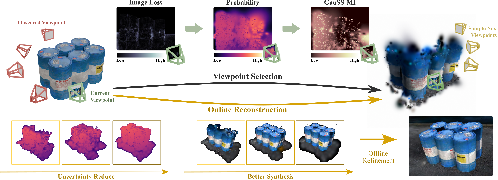

<div align="center">
    <h1>GauSS-MI: Gaussian Splatting Shannon Mutual Information for Active 3D Reconstruction</h1>
    <strong>RSS 2025</strong>
    <br>
    Yuhan Xie, Yixi Cai, Yinqiang Zhang, Lei Yang, and Jia Pan
    <br>
    <a href="https://www.roboticsproceedings.org/rss21/p030.pdf">paper</a> | <a href="https://arxiv.org/abs/2504.21067">arxiv</a> 
</div>

<br>
<div align="center">
    
    
</div>
<div align="center">
    
    
</div>

<!--**Method Overview:**
<div align="center">

</div>-->

### 📢 News
- **30 May. 2025**: Complete code expected to be released by mid June.
- **28 May. 2025**: Submodule [Differential Gaussian Rasterization with GauSS-MI](https://github.com/JohannaXie/diff-gaussian-rasterization-gaussmi) released. 

### 🔗 BibTeX
If you find our code/work useful, please consider citing:
```
@article{xie2025gaussmi,
  title     = {GauSS-MI: Gaussian Splatting Shannon Mutual Information for Active 3D Reconstruction},
  author    = {Yuhan Xie, Yixi Cai, Yinqiang Zhang, Lei Yang, and Jia Pan},
  journal   = {arXiv preprint arXiv:2503.02881},
  year      = {2025}
}
```

#### Acknowledgements
This project builds heavily on [MonoGS](https://github.com/muskie82/MonoGS) and [3D Gaussian Splatting](https://github.com/graphdeco-inria/gaussian-splatting). We thanks the authors for their excellent works! If you use our code, please consider citing the papers as well.

## Environment Setup
#### Requirements
* Most hardware and software requirements same as [3D Gaussian Splatting](https://github.com/graphdeco-inria/gaussian-splatting) Optimizer.
* Conda (recommended for easy setup)
* CUDA Toolkit 11.8
* ROS1 Noetic + Ubuntu 20.04 (for active reconstruction part)
#### Clone the Repository
```bash
git clone git@github.com:JohannaXie/GauSS-MI.git --recursive
cd GauSS-MI
```
#### Conda Setup
```bash
conda env create -f environment.yml
conda activate GauSS-MI
```
